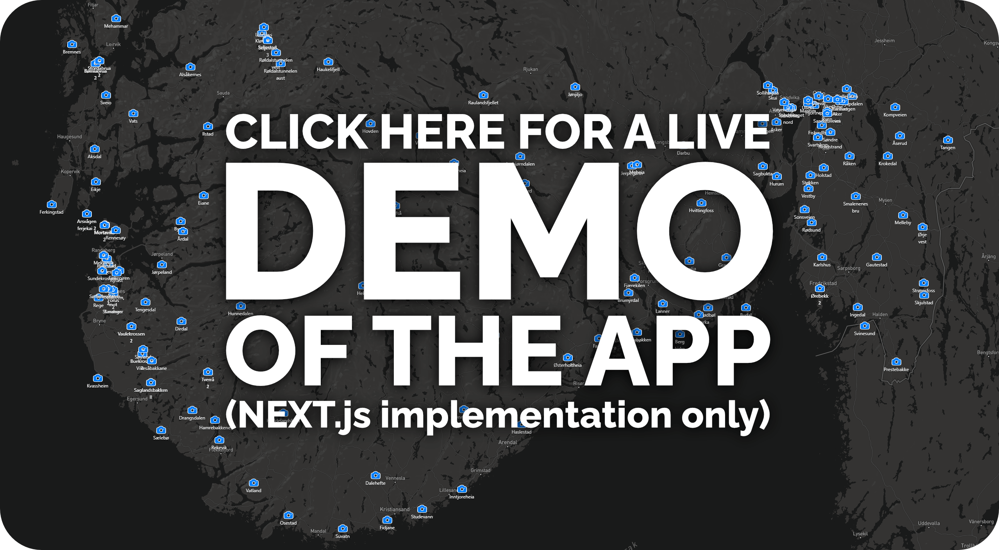

# RoadCam <!-- omit in toc -->

 

## Table of Contents <!-- omit in toc -->

- [TODO](#todo)
  - [Minimum](#minimum)
  - [Bonus](#bonus)
- [Stack](#stack)
  - [Project Architecture and Main Tools](#project-architecture-and-main-tools)
  - [Notes after some experimenting:](#notes-after-some-experimenting)

## TODO

Create a small web application showing road camera information.

### Minimum

- [x] Create an Express + Node JS app serving a simple single page web application
- [x] Get a MapBox development access token and add MapBox to your project
- [x] Download the data file (see resources below) and add it to your project
- [x] Download the icon file (see resources below) and add it to your project
- [x] Add a marker for every road camera in the map view by loading them using a fetch GET
request from an express HTTP endpoint
- [x] Clicking a camera in the map should display information in a popup

### Bonus

- [x] Store and fetch the camera locations from a Mongo DB database
- [ ] Add a search field that displays a filtered list of cameras based on name
- [ ] Make the list sorted by distance to the user’s current location

<!-- ### Resources

- [Road cameras geoJSON](https://www.dropbox.com/sh/5cibj2j7idvuynw/AACxDaarpU0EI1GR-bG8xXoga?dl=0)
- [Road camera icon](https://www.dropbox.com/s/kvvpk3rq57jdskd/camera%402x.png?dl=0) -->

## Stack

All proposals will be using [TypeScript](https://www.typescriptlang.org/) where possible (some configuration files may be omitted).

---

🚫 **~~Vanilla [React](https://reactjs.org/) + [Node](https://docs.expo.io/workflow/web/) with [Express](https://expressjs.com/)~~**

~~Using [`create-react-app` with TypeScript template](https://create-react-app.dev/docs/adding-typescript/).~~

- ~~Will work with almost anything (it's basically the `Hello World!` of modern web development)~~
- ~~Instant deployment and hosting using [Vercel](https://vercel.com/)~~
- ~~[Supports Unity3D with API](https://www.npmjs.com/package/react-unity-webgl)~~

---

✅ **[NEXT](https://nextjs.org/) with [Express using API Routes](https://vercel.com/guides/using-express-with-vercel)**

- Fully supported by [NX](https://nx.dev/latest/react/guides/nextjs)
- Instant deployment and hosting using [Vercel](https://vercel.com/) for free
- Serverless functions
- Static Site Generation (SSG) and Server Side Rendering (SSR) out-of-the-box
- [Supports Unity3D with API](https://www.npmjs.com/package/react-unity-webgl)  
_([SSR workaround available](https://github.com/jeffreylanters/react-unity-webgl/issues/139#issuecomment-790525055) and [SSR is in the pipeline](https://github.com/jeffreylanters/react-unity-webgl/issues/139#issuecomment-790476259))_

_NEXT is a product of Vercel, so implementation may be more stable and developer friendly than other alternatives_

---

🚫 **~~[Expo](https://expo.io/) + [Node](https://docs.expo.io/workflow/web/) with [Express](https://expressjs.com/)~~**

~~Using [React Native for Web](https://docs.expo.io/workflow/web/).~~

- ~~Instant deployment and hosting using [Vercel](https://vercel.com/)~~
- ~~[Supports Unity3D view only](https://www.npmjs.com/package/react-unity-webgl)~~  
~~_API between Unity3D and the different platforms can be done, but requires native implementations for all platforms._~~
- ~~Native Apps for iOS and Android using the same codebase~~

---

Almost none of the extra features will be utilized here, but it's fun pretending this thing is gonna scale. 📈

I went with NEXT, as it cuts resources spent on development, scalability and deployment to a minimum. It also has lots of nice-to-have features, like server-side rendering and static site generation out-of-the-box.

It might seem like overkill for a single page application, but given it's as easy to setup as a vanilla React app (if not easier) combined with Vercel's support for SSG and simple (and free) deployment, it makes sense.

React is more familiar to most devs compared to Expo/React Native, so we'll save some time getting them up and running as well.

PWAs are possible with this alternative, which allows for local app installation and offline support for all major operating systems and devices:

- Windows
- Linux
- Mac
- iOS (and iPadOS)\*
- Android

\*The only downside is PWAs are not yet allowed on the App Store (iOS), even though they are permitted elsewhere (e.g., Google Play and Windows Store). Users can still save the app to their iOS home screens, but full API access to the OS is missing.

This is likely to change when PWAs become more widespread, though, assuming antitrust laws are following suit.

Having all React-libraries at disposal is a huge plus (as opposed to React Native/Expo); especially the possibility to use Unity builds, in case we want to move map navigation or other features to a more solid 3D-environment down the line.

### Project Architecture and Main Tools

Well yeah... This may be a mess, or it may be awesome. I'll explore some new stuff I haven't really used before, so it'll be hit or miss for some of 'em:

- Monorepo using ~~[Yarn Workspaces](https://classic.yarnpkg.com/en/docs/workspaces/)~~ or [NX](https://nx.dev/)\*
- ~~[Emotion](https://emotion.sh/docs/introduction)~~/[Styled Components](https://styled-components.com/)/~~[Styled JSX](https://www.npmjs.com/package/styled-jsx)~~ for CSS-in-JS\*\*
- [Next API routes](https://vercel.com/guides/using-express-with-vercel) (in addition to a traditional [Express implementation with Node](https://expressjs.com/))***
- [Storybook](https://storybook.js.org/) for isolated, pure, testable and documented components using****
- [React Map GL](https://github.com/visgl/react-map-gl) from [VisGL](https://github.com/visgl)*****

---

>#### Notes after some experimenting:
>
>\*Yarn Workspaces was a drag, as it's too low level. NX is a joy to work with, and I'll probably use it as a default for any upcoming projects. 👍
>
>\*\*Emotion has turned their package naming on its head with v11, and so nothing works out-of-the-box anymore. 😤   
>Styled components has a similar feature set, but is more focused on solutions >I don't enjoy. It's what I went with because of the CSS-prop, but in >hindsight it brought with it so many complications it's not worth it (for me)>. 😔  
>Styled JSX seems like a good alternative, being a lot simpler while avoiding some pitfalls of Emotion and Styled Components. It's also the default CSS-in-JS for NEXT.js. 🤔  
>Maybe good old SASS would be a better solution, but I'm not a fan of leaking styles all over the place, while separating styles from components.  
>Maybe inline styles and the odd stylesheet isn't such a bad idea after all? 🤷‍♂️
>
>
>\*\*\*Free serverless functions hosted on Vercel? Sign me up. Code needs some >small modifications, but the overall setup is a lot cleaner than having a >separate backend - especially for smaller projects. Might start using this more. 👌
>
>\*\*\*\*Storybook is a winner. Makes it sooo much more fun to create components that are actually reusable (even across apps and frameworks). Add NX's auto-setup on top of that? Yes, please! 💘
>
>\*\*\*\*\*`react-map-gl`? Meh. The wrapper could've been typed better (so much googling 🥵) and basic features are missing. Spent way to much time trying to get clustering to work with custom components, but it sadly isn't supported here. There's <a href="https://github.com/urbica/react-map-gl">Urbica's React library for mapbox-gl</a>, which offers features one would expect from a basic map library, but it isn't typed at all.  
>Couldn't find a good alternative.  
>Big sad.

---

### Bonus: MongoDB

I used MongoDB's [Atlas](https://www.mongodb.com/cloud/atlas) as a database, so we don't need to do any hosting or maintenance ourselves.

---

>#### Notes and thoughts
>
>After playing with tools like NX, Next, Vercel, Docker and InfluxDB, I am surprised at how bad some of the developer experience using MongoDB actually is - especially for newcomers. When you're one of the database big boys™ 💪 your cloud hosted DB should support drag 'n' drop uploads for basic things like JSON-data. I'm just saying.
>
>I will most likely try to find something else for upcoming projects.
>
>Maybe a solution where types can be defined once in a monorepo and reused by the frontend and backend would be nice? 🤔💭
>
>Maybe something in the realm of GraphQL would be best, when I want to define types anyway.

---